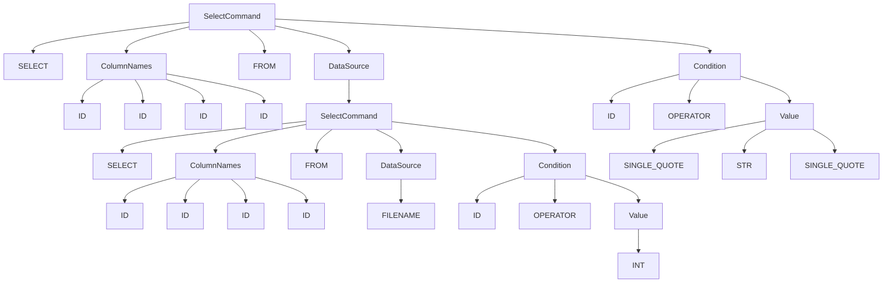

# Week 3

In [week 2](week2.md), we took significant steps by implementing a simple CLI and validating and extracting data from `INSERT` statements.

Now, our journey progresses to a more intricate aspect of our language: handling `SELECT`` statements.

## Convert query string into a data structure

In our journey to process and understand queries more effectively, we introduced the concept of a `query command`. This structured data representation serves as a bridge between the raw query and the eventual execution process. While our `INSERT` statement could be elegantly encapsulated using a simple C++ struct, the complexities of the `SELECT` statement necessitate a more sophisticated approach.

### Representing `INSERT` with a Struct

We can see that the data extracted from an `INSERT` statement could be neatly captured within a C++ struct:

```c++
struct InsertCommand {
    string filename;
    vector<string> columnNames;
    vector<string> values;
};
```

This straightforward structure aligns well with the simplicity of the `INSERT` statement.

### Challenges of Representing `SELECT`

However, the `SELECT` statement introduces a new set of challenges. Its syntax supports subqueries and multiple conditions, making it impossible to represent the query's structure using a predefined struct. For instance:

```sql
SELECT id, name, email
FROM (
    SELECT id, name, email, age
    FROM members.csv
    WHERE age > 22
)
WHERE name LIKE '%Vinh%' AND email LIKE '%@hcmut.edu.vn';
```

As seen in the above example, the structure of a `SELECT` query depends on how it's expressed, and it can involve subqueries and multiple logical conditions.

To tackle the complexities introduced by the `SELECT` statement, we need a dynamic data structure (e.g tree, linked list ...). This hierarchical structure allows us to represent the intricate relationships present in a query. The data structure will help us:

- **Organize Logic**: Hierarchically organize the various clauses, subqueries, conditions, and relationships in the query.
- **Understand Semantics**: Reflect the semantics of the query, ensuring that we correctly interpret the programmer's intentions.
- **Optimize Execution**: Serve as a foundation for query optimization, enabling us to choose the most efficient execution plan.

### Constructing the Query Command

Constructing the query command involves two main stages: tokenization using a lexer and syntactic analysis using a parser. These processes work together to break down the raw query into manageable tokens and understand their syntactic and semantic relationships.

- **Lexer (Tokenization)**: Transform the raw query string into a sequence of tokens, categorizing them by type and lexeme. These tokens form the basis for further analysis.
- **Parser (Syntactic Analysis)**: The parser processes the stream of tokens generated by the lexer. It constructs a structured representation of the query, often called a parse tree or syntax tree. The parser ensures that the token sequence adheres to the language's grammar rules.
- **Query Command Construction**: The parse tree serves as a blueprint for building the query command. This higher-level representation captures the query's semantics and removes unnecessary syntactic details.

By constructing and utilizing a query command, we bridge the gap between a programmer's query and its execution. The command provides a structured, semantically meaningful representation, essential for optimizing, understanding, and executing queries effectively.

## Requirements

Because our CSV query language is not 

### Lexer (Tokenization)

The Lexer phase is responsible for breaking down the input query string into tokens, each representing a meaningful component of the language. Each token will have a type and a value. Here's what's expected from the Lexer.

1. **Token Definition**
    - Define a set of token types that capture the different components of the language. This includes keywords, identifiers, values, punctuation symbols, and other relevant elements. For example:
        - ACTION: Represents actions like "INSERT" or "SELECT".
        - INTO: Represents the keyword "INTO".
        - FROM: Represents the keyword "FROM".
        - VALUES: Represents the keyword "VALUES".
        - ID: Represents identifiers like filenames, values, or column names.
        - ...
2. **Token Extraction**
   - Implement the mechanism to identify and extract tokens from the query string based on defined patterns.
   - Regular expressions (using `std::regex` or similar libraries) can be highly effective for this purpose.
3. **Token Classification**
   - Assign the appropriate token type to each extracted token based on the identified patterns.
   - Ensure that each token is categorized accurately.
4. **Token Creation**
   - Create a Token struct that encapsulates the type and value of each token. For instance:
        ```cpp
        enum TokenType { ... };
        struct Token {
            TokenType type;
            string value;
        };
        ```
5. **Handling Whitespace**
    - Skip over unnecessary whitespace and comments during tokenization. These elements don't contribute to the semantics of the language. 
6. **Error Handling**
    - Implement appropriate error handling mechanisms. If the lexer encounters an unrecognized sequence of characters, it should generate an error and halt the process.

For example, give an `INSERT` statement: 

```sql
INSERT INTO example.csv VALUES (1, 2, "hello world");
```

The statement above can be seperated into: `INSERT`, `INTO`, `example.csv`, `VALUES`, `(`, `1`, `2`, `hello world`, `)`.

> Note that ***you can define token type by yourself***. Depend on your definition, seperated tokens can be different from the example.

### Parser (Syntactic Analysis)

In the previous Lexer phase, we transformed the raw query string into a sequence of tokens. However, having recognized tokens doesn't necessarily ensure that the sequence is a valid and meaningful query. For example: `data.csv SELECT VALUES *` is not a valid query.

The Parser phase ensures that the sequence of tokens adheres to the grammar rules of our CSV Query Language, constructing a syntactic representation of the query's structure.

Your responsibles:

1. **Token Validation**: Check the sequence of tokens to confirm if they adhere to the expected grammar rules. Validate that the tokens form a valid query according to the language's syntax.
2. **Detect Invalid Sequences**: Detect and report invalid token sequences. If the sequence of tokens doesn't adhere to the language's grammar, generate informative error messages that highlight the issue and potentially its location.
3. **Construct Parse Tree**: From list of tokens, construct a parse tree that captures the syntactic structure of the query. Each node in the parse tree should correspond to a meaningful grammatical element.

To illustrate a parse tree, let's consider the `SELECT` below:

```sql
SELECT id, name, email, phone FROM (
  SELECT id, name, email, age, phone
  FROM member.csv
  WHERE age > 22
)
WHERE name LIKE '%Vinh%'
```

This query can be parsed into a tree like this:



With nodes that have name in uppercase format are terminal nodes (contain token data), and nodes that have name in Pascal case are non-terminal node (contain multiple terminal nodes).

### Query Command


<!--
Regarding [query command construction](#constructing-the-query-command), a query command has higher level than parse tree. A parse tree can contain some unnecessary tokens like brackets, `INTO`/`FROM` words, commas, single quotes, ... Your responsible is captures the query's semantics and removes unnecessary syntactic details.

In Lexer phase and Parser phase, you are free to define your own rule. But in this phase, you MUST use these classes to contain query data:

```cpp
class Command {
public:

    void print();
};

class Insert
``` -->
